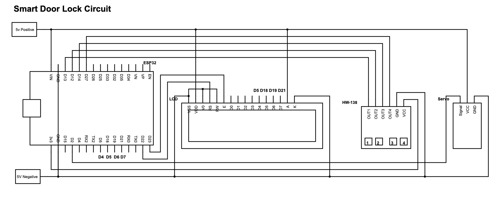

# Smart-Door-Lock

## Description of the Lock Module 
The lock module consists of an ESP32 microcontroller, a 16x2 LCD display, an HW-138 keypad, and a SG90 servo motor all powered by a 5v USB cable. The ESP32 stores three pieces of information for each user: the name, a 4-digit id, and a 4-digit pin. To unlock the door, the user has to enter an 8-digit passcode 
which is the combination of their id and pin. To unlock the door, the user enters the same code again. To change the name and pin, the user must use the companion app to do so. 

### Prototype

### Wiring

### Final Package

## Materials Required
* ESP32
* 16x2 LCD display
* HW-138 touchpad
* Servo motor
* USB cable for power
* A USB power brick to plug into the wall
* A few wires to connect everything together (I used old ethernet cables)

## Circuit Diagram

## Description of Android Application
The app consists of three fragments: the home fragment, the history fragment, and the settings fragment. 
The home fragment consists of a toggle button to let the user lock/unlock the door. When the door is unlocked, the red unlocked icon will appear and when the door is locked, the green locked icon will appear. 
The history fragment keeps track of everyone who has locked/unlocked the door and at what time. Whenever the door is locked or unlocked, the ESP32 figures out who the user is by their pin and sends that data to the app. The app then keeps track of the user's name, whether they locked or unlocked the door, and the time they locked/unlocked the door. 
The settings fragment allows the user to change their name and pin. This new information will be sent to the ESP32 once the user presses the save button.

Feel free to contact me at riri.hong@gmail.com if you have any questions!
